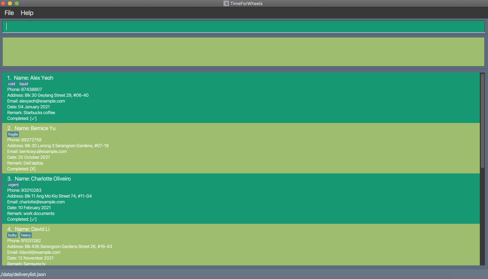

# User Guide

TimeForWheels is an app for delivery drivers to manage their orders efficiently. It is optimized for use via a Command
Line Interface while still having the benefits of a Graphical User Interface(GUI). Overall, TimeForWheels aims to
increase work productivity for delivery drivers by simplifying the delivery management and planning process.

* **Table of Contents**
    * Quick Start
    * Features
        * Viewing help
        * Add delivery points
        * Delete delivery points
        * List all delivery points
        * Mark delivery as Done
        * Exit application

--------------------------------------------------------------------------------------------------------------------

## Quick start

1. Ensure you have Java `11` or above installed in your Computer.

1. Download the latest `addressbook.jar` from [here](https://github.com/se-edu/addressbook-level3/releases).

1. Copy the file to the folder you want to use as the _home folder_ for your AddressBook.

1. Double-click the file to start the app. The GUI similar to the below should appear in a few seconds. Note how the app
   contains some sample data. 
   

1. Type the command in the command box and press Enter to execute it. e.g. typing **`help`** and pressing Enter will
   open the help window. 
   Some example commands you can try:

    * **`list`** : Lists all delivery points

    * **`add`**`a/John street, block 123, #01-01` : Adds a delivery point called `John street, block 123, #01-01` to the
      Delivery list.

    * **`delete`**`3` : Deletes the 3rd delivery point shown in the current list.

    * **`done`**`3` : Marks the 3rd delivery task as done.

    * **`exit`** : Exits the app.

1. Refer to the [Features](#features) below for details of each command.

--------------------------------------------------------------------------------------------------------------------

## Features

**:information_source: Notes about the command format:** 

* Words in `UPPER_CASE` are the parameters to be supplied by the user. 
  e.g. in `add n/NAME`, `NAME` is a parameter which can be used as `add n/John Doe`.

* Items in square brackets are optional. 
  e.g `n/NAME [t/TAG]` can be used as `n/John Doe t/friend` or as `n/John Doe`.

* Items with `…`​ after them can be used multiple times including zero times. 
  e.g. `[t/TAG]…​` can be used as ` ` (i.e. 0 times), `t/friend`, `t/friend t/family` etc.

* Parameters can be in any order. 
  e.g. if the command specifies `n/NAME p/PHONE_NUMBER`, `p/PHONE_NUMBER n/NAME` is also acceptable.

* If a parameter is expected only once in the command but you specified it multiple times, only the last occurrence of
  the parameter will be taken. 
  e.g. if you specify `p/12341234 p/56785678`, only `p/56785678` will be taken.

* Extraneous parameters for commands that do not take in parameters (such as `help`, `list`, `exit` and `clear`) will be
  ignored. 
  e.g. if the command specifies `help 123`, it will be interpreted as `help`.

### Viewing help : `help`

**Purpose:** Shows all the available commands and how to use them

**Format:** `help`

**Examples:**

* `help` - Help returns Adding a delivery task: add Deleting a delivery task: delete Listing the delivery task: list
  Finding a delivery task: find Seeking for tech-support: help

### Viewing all delivery points : `list`

**Purpose:** Shows all the delivery points

**Format:** `list`

**Examples:**

* `list` - Lists all the delivery points

### Adding a delivery point: `add`

**Purpose:** Adds a delivery task to the delivery list.

**Format:** `add a/ADDRESS d/DATETIME`

**Examples:**

* `add a/John street, block 123, #01-01 d/2021-03-01 1000
  `
* `add a/Newgate Prison d/2022-05-01 1200
  `

### Deleting a delivery task : `delete`

**Purpose:** Deletes the specified delivery location from the delivery list.

**Format:** `delete INDEX`

* Deletes the delivery at the specified INDEX.
* The index refers to the index number shown in the displayed delivery list.
* The index must be a positive integer 1, 2, 3,

**Examples:**

* `delete 2` - delete 2 will delete the second delivery location in the delivery list.

### Mark a delivery as done : `done`

**Purpose:** Set a delivery task in the delivery list to done

**Format:** `done INDEX`

* Sets the delivery at the specified INDEX to done.
* The index refers to the index number shown in the displayed delivery list.
* The index must be a positive integer 1, 2, 3,

**Example:**

* `done 2` - done 2 will set the second delivery location in the delivery list as done.

### Exiting the program : `exit`

**Purpose:** Exits the program.

**Format:** `exit`

**Examples:**

* `exit` - Exits the program

--------------------------------------------------------------------------------------------------------------------

## FAQ

**Q**: How do I transfer my data to another Computer? 
**A**: Install the app in the other computer and overwrite the empty data file it creates with the file that contains
the data of your previous AddressBook home folder.

--------------------------------------------------------------------------------------------------------------------

## Command summary

Action | Format,  Example(s)
--------|------------------
**Help** | `help`  e.g., `help`
**Add** | `add a/ADDRESS d/DATETIME`   e.g., `add `a/123, Clementi Rd, 1234665 d/01-02-2021`
**Delete** | `delete INDEX`  e.g., `delete 3`
**List** | `list`  e.g., `list`
**Done** | `done INDEX`  e.g., `done 2`
**Exit** | `exit`  e.g., `exit`

